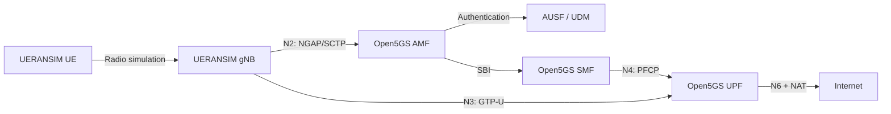

# open5gs-ueransim-5g-core-lab
End-to-end 5G SA Core lab using Open5GS, MongoDB, and UERANSIM with eSIM concepts, GTP-U, PFCP, Internet connectivity, and troubleshooting.

# End-to-End 5G SA Core Lab with Open5GS and UERANSIM

This project demonstrates an end-to-end **5G Standalone (SA) Core network** using Open5GS, MongoDB, and UERANSIM on Ubuntu 24.04 under WSL.

The lab covers subscriber provisioning, 5G authentication, registration, network slicing, PDU-session establishment, GTP-U/PFCP traffic, Internet connectivity, eSIM concepts, monitoring, and troubleshooting.

## Project Objectives

- Deploy an operational 5G SA Core
- Simulate a gNB and UE using UERANSIM
- Provision a test subscriber in MongoDB
- Establish N2, N3, and N4 connectivity
- Authenticate and register the UE
- Create an IPv4 PDU session
- Validate GTP-U user-plane traffic
- Provide Internet access through the UPF
- Capture and analyze PFCP and GTP-U packets
- Apply systematic 5G Core troubleshooting
- Relate the lab to travel-eSIM operations

## Lab Environment

| Component | Version/Configuration |
|---|---|
| Operating system | Ubuntu 24.04 on WSL |
| 5G Core | Open5GS 2.8.0 |
| Database | MongoDB 8.0 |
| RAN/UE simulator | UERANSIM 3.3.0 |
| Test PLMN | MCC 999 / MNC 70 |
| Tracking Area Code | 1 |
| Network slice | SST 1 |
| DNN/APN | `internet` |
| UE subnet | `10.45.0.0/16` |
| UPF tunnel interface | `ogstun` |
| UE namespace | `ueransim-999700000000001-internet-psi1` |

## Architecture



## Important Interfaces

| Interface | Connection | Protocol |
|---|---|---|
| N1 | UE ↔ AMF through gNB | NAS |
| N2 | gNB ↔ AMF | NGAP over SCTP |
| N3 | gNB ↔ UPF | GTP-U over UDP 2152 |
| N4 | SMF ↔ UPF | PFCP over UDP 8805 |
| N6 | UPF ↔ Internet | IP |

## Core Service Validation

```bash
systemctl is-active mongod open5gs-amfd open5gs-smfd \
open5gs-upfd open5gs-ausfd open5gs-udmd \
open5gs-udrd open5gs-nrfd open5gs-pcfd
```

All required MongoDB and Open5GS services returned:

```text
active
```

## Starting the gNB

```bash
sudo ~/UERANSIM/build/nr-gnb \
-c ~/UERANSIM/config/open5gs-gnb.yaml
```

Successful N2 establishment:

```text
SCTP connection established
NG Setup Response received
NG Setup procedure is successful
```

## Starting the UE

```bash
sudo ~/UERANSIM/build/nr-ue \
-c ~/UERANSIM/config/open5gs-ue.yaml
```

Successful registration and session establishment:

```text
Initial Registration is successful
PDU Session establishment is successful PSI[1]
```

## UE Registration Status

```bash
sudo ~/UERANSIM/build/nr-cli \
imsi-999700000000001 -e status
```

Healthy state:

```text
cm-state: CM-CONNECTED
rm-state: RM-REGISTERED
mm-state: MM-REGISTERED/NORMAL-SERVICE
selected-plmn: 999/70
current-tac: 1
```

## PDU Session

```bash
sudo ~/UERANSIM/build/nr-cli \
imsi-999700000000001 -e ps-list
```

Result:

```text
state: PS-ACTIVE
session-type: IPv4
apn: internet
sst: 0x01
address: 10.45.0.6
```

## Linux Forwarding and NAT

Enable IPv4 forwarding:

```bash
sudo sysctl -w net.ipv4.ip_forward=1
```

Add source NAT for the UE subnet:

```bash
sudo iptables -t nat -A POSTROUTING \
-s 10.45.0.0/16 ! -o ogstun -j MASQUERADE
```

## User-Plane Validation

Test UE-to-UPF connectivity:

```bash
sudo ip netns exec \
ueransim-999700000000001-internet-psi1 \
ping -c 4 10.45.0.1
```

Test Internet connectivity:

```bash
sudo ip netns exec \
ueransim-999700000000001-internet-psi1 \
ping -c 4 8.8.8.8
```

Test DNS:

```bash
sudo ip netns exec \
ueransim-999700000000001-internet-psi1 \
ping -c 4 google.com
```

Application-layer test:

```bash
sudo ip netns exec \
ueransim-999700000000001-internet-psi1 \
curl -sS --max-time 10 -o /dev/null \
-w 'HTTP=%{http_code} DNS=%{time_namelookup}s CONNECT=%{time_connect}s TOTAL=%{time_total}s\n' \
https://www.google.com
```

Measured result:

```text
HTTP=200
DNS=0.062389s
CONNECT=0.133011s
TOTAL=0.499006s
```

## GTP-U Verification

The gNB and UPF listened on the standard GTP-U port:

```text
127.0.0.1:2152  UERANSIM gNB
127.0.0.7:2152  Open5GS UPF
```

Packet capture:

```bash
sudo tcpdump -ni lo 'udp port 2152'
```

Observed path:

```text
127.0.0.1:2152 → 127.0.0.7:2152
127.0.0.7:2152 → 127.0.0.1:2152
```

This confirmed bidirectional N3 user-plane traffic.

## PFCP Verification

The SMF and UPF listened on PFCP port 8805:

```text
127.0.0.4:8805  Open5GS SMF
127.0.0.7:8805  Open5GS UPF
```

Packet capture:

```bash
sudo timeout 15 tcpdump -ni lo -vv \
'udp port 8805' -c 2
```

The capture confirmed PFCP heartbeat request and response traffic across N4.

## Troubleshooting Exercise

A controlled fault was created by disabling IPv4 forwarding:

```bash
sudo sysctl -w net.ipv4.ip_forward=0
```

Observed behavior:

- UE remained registered
- PDU session remained active
- UE could reach `10.45.0.1`
- UE could not reach `8.8.8.8`

This isolated the problem to the forwarding/NAT layer rather than authentication, registration, or GTP-U.

Service was restored with:

```bash
sudo sysctl -w net.ipv4.ip_forward=1
```

## Real Incident Diagnosed

During the capstone, the AMF temporarily lost its NRF heartbeat. The UE later attempted periodic registration using a stale NAS security/protocol context.

Relevant symptoms included:

```text
RM-DEREGISTERED
MM-DEREGISTERED/LIMITED-SERVICE
Non cleartext IEs is included
Registration reject [95]
MESSAGE_NOT_COMPATIBLE_WITH_PROTOCOL_STATE
```

The AMF successfully re-registered with the NRF. Restarting the UE cleared the stale context and forced fresh authentication.

After recovery:

```text
MM-REGISTERED/NORMAL-SERVICE
PDU Session establishment is successful
HTTP=200
```

## eSIM Relevance

In a real eSIM environment:

- The **eUICC** securely stores the operator profile.
- The **LPA** downloads and manages the profile.
- The **SM-DP+** securely prepares and delivers it.
- The installed profile contains the subscriber identity and authentication credentials.
- The mobile Core authenticates the eSIM subscriber similarly to a physical-SIM subscriber.

In this lab:

| Real eSIM component | Lab equivalent |
|---|---|
| Installed profile | UERANSIM UE configuration |
| Subscriber identity | Test SUPI/IMSI |
| Operator database | MongoDB/Open5GS UDR |
| Mobile device | UERANSIM UE |
| Mobile network Core | Open5GS |

The lab also examined travel-eSIM concepts including the home PLMN, visited PLMN, roaming authorization, home routing, local breakout, APN/DNN configuration, and IP-exit location.

## Security Notice

This repository is intended for educational and laboratory use.

Do not publish real subscriber credentials, production IMSIs, authentication keys, OP/OPc values, private certificates, or operator configuration data. Any configuration examples should use placeholders such as:

```yaml
key: 'REPLACE_WITH_TEST_KEY'
op: 'REPLACE_WITH_TEST_OPC'
```

## Skills Demonstrated

- 5G Standalone Core deployment
- Open5GS configuration
- UERANSIM gNB and UE operation
- MongoDB subscriber provisioning
- NAS registration and authentication
- Network slicing and DNN configuration
- PDU-session establishment
- NGAP, GTP-U, and PFCP
- Linux namespaces, routing, and NAT
- Packet capture with `tcpdump`
- Core log analysis with `journalctl`
- Fault isolation and service recovery
- eSIM and roaming architecture

## Disclaimer

This project uses simulated radio access and test subscriber data. It does not connect to a commercial mobile network or transmit over real radio hardware.

## License

This project is licensed under the MIT License.
